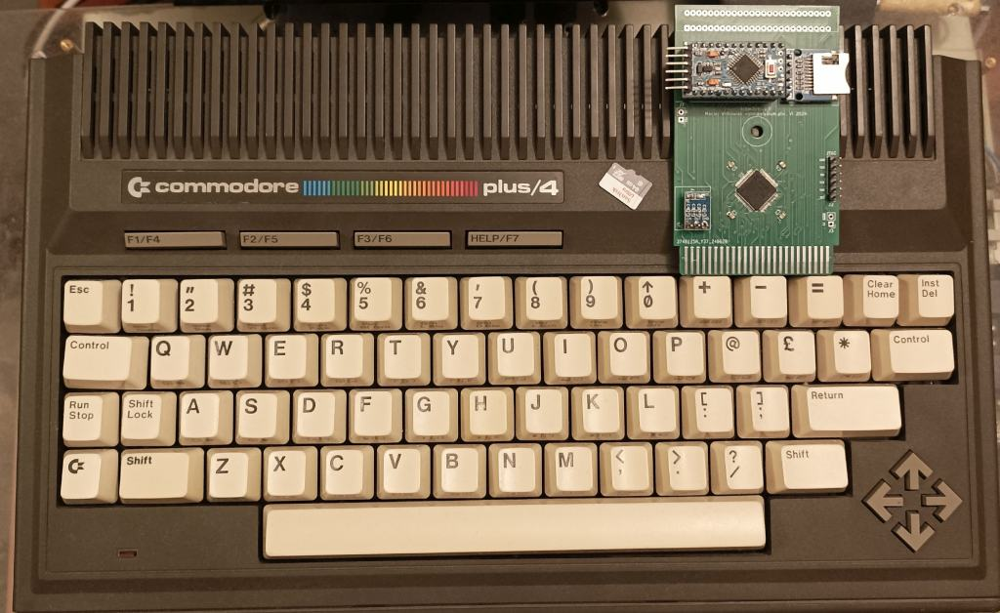
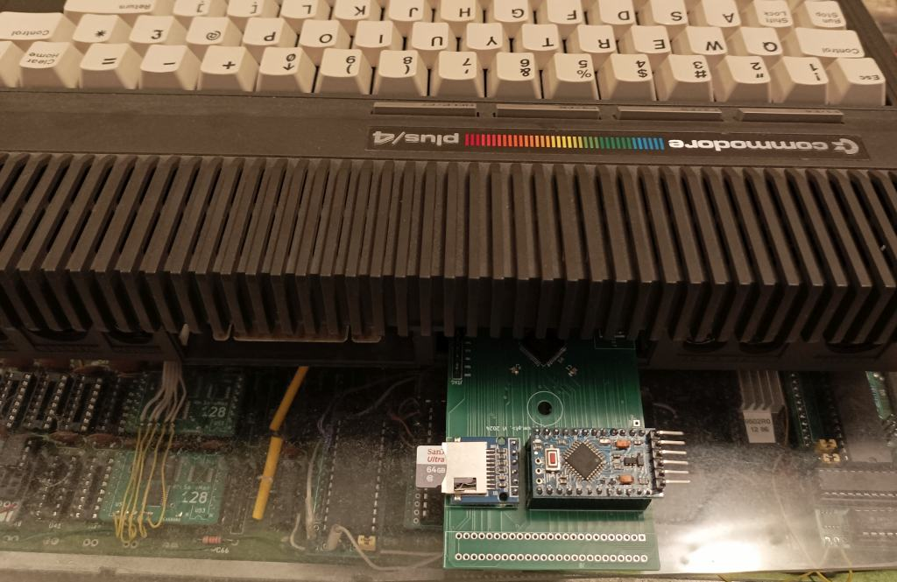
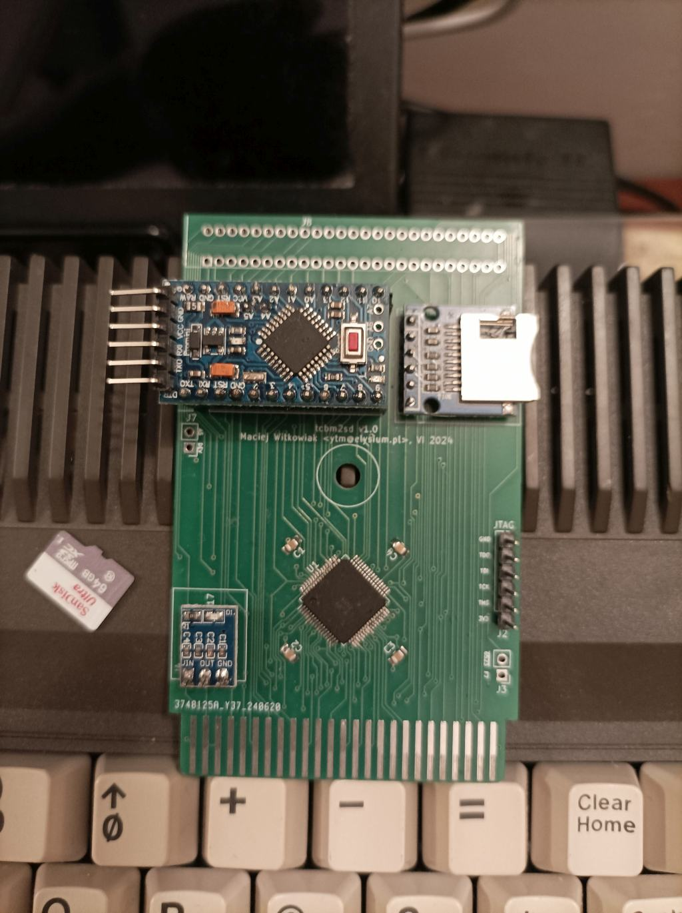
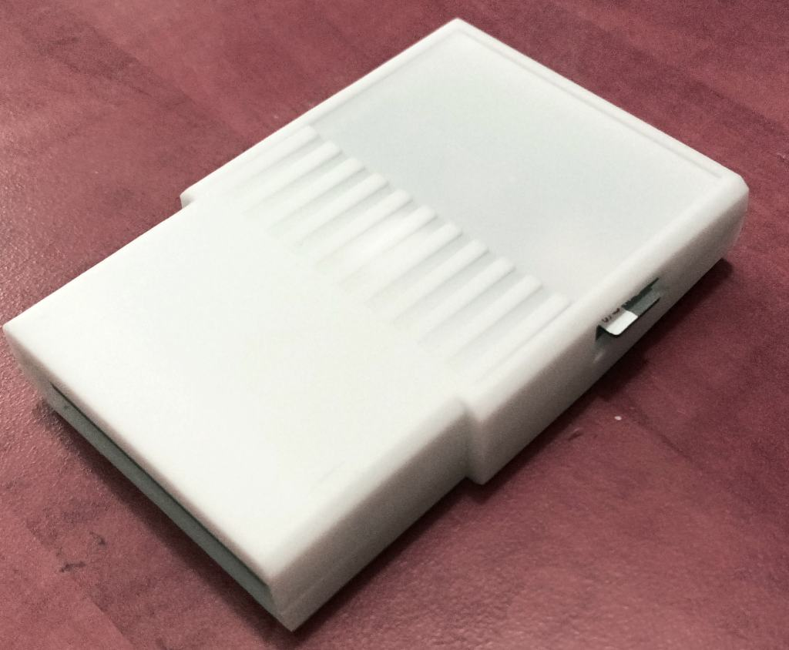
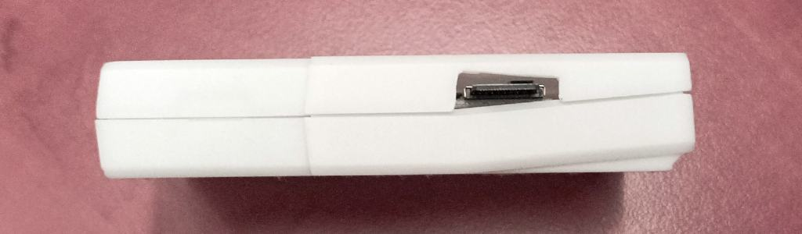
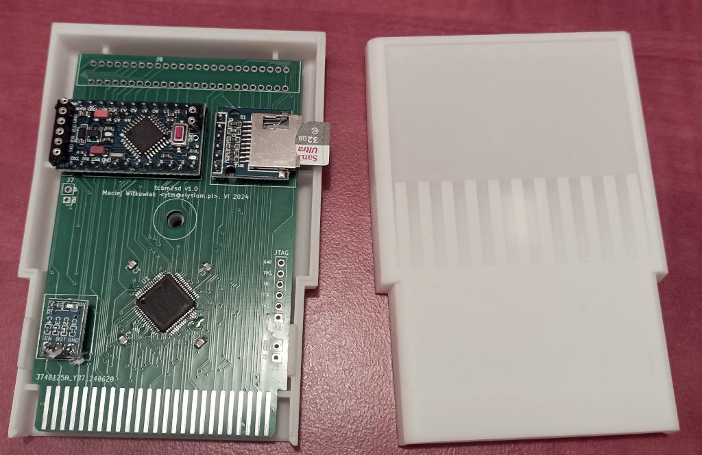

# TCBM2SD 
---------
### by Maciej 'YTM/Elysium' Witkowiak

CBM 1551 paddle replacement and/or mass storage using an SD card interfacing with the Commodore C16/116/Plus4 simulating a TCBM bus 1551 disk drive.

## Ecosystem

This board can also serve as the Commodore-side TCBM interface for the [Pi1551](https://github.com/ytmytm/Pi1551), a cycle-exact Commodore 1551 emulator for Raspberry Pi. It can be used with either the [Pi1551-HAT](https://github.com/ytmytm/PI1551-hat) or [Pi1551-III](https://github.com/ytmytm/PI1551-III) interface.

It is also the TCBM interface for the [1551-rePico](https://github.com/ytmytm/1551-rePico), a 1551 drive replacement that uses a real 6510T with Raspberry Pico 2 emulating the analog parts.

The [Parobek function ROM](https://github.com/ytmytm/plus4-parobek) is a useful way to populate the 32/64 KiB ROM socket. It includes the TCBM2SD boot software, so `boot.t2sd` is not needed when using that ROM.

## Detailed manuals

- [User's manual](UserManual.md)
- [Hardware assembly, firmware compilation and flashing](HardwareFirmware.md)

## Software

- Supported by [Siz's I/O library v4](https://github.com/iszell/siziolib)
- [GEOS for tcbm2sd (D64)](geos/geostcbm.d64)
- [Collection of patched disk games](games/)
- [Parobek function ROM](https://github.com/ytmytm/plus4-parobek)
<!-- XXX patched cartridge images: OctaBASIC, Gamecart -->

[ZIP archive of the above](https://drive.google.com/drive/folders/1UYzHO3PNRJw3JCk5QNncfK0rwXZ2pFXH?usp=drive_link)

## Media

### Commodore Users Europe presentation

<a href="https://www.youtube.com/watch?v=iNGW5h6bXoA" target="_blank">
 
 
<small>Click for video</small>

</a>

### Photos

*The photos and PCB view below show an older board revision and are provided for reference only.*

### Basic operations

<a href="https://www.youtube.com/watch?v=6DOctO64GS4" target="_blank">
 
 
<small>Click for video</small>

</a>

### Fastloader

<a href="https://www.youtube.com/watch?v=Cf42Z9H2JiA" target="_blank">
 
 
<small>Click for video</small>

</a>

## Features

### Drive simulator

TCBM2SD does not emulate a 1551, but simulates its behavior:

- DLOAD and DSAVE support for files
- read-only support for disk images (D64, D71, D81, D80, D82) as subdirectories
- standard Kernal transfer at about 3100 b/s (a little less than JiffyDOS 1541, and about twice as fast as a 1551 at 1600 b/s); fastload at about 9300 b/s (**23×** as fast as a 1541, about **6×** as fast as a 1551), with [patched Directory Browser v1.2](loader/); on par with DolphinDOS
- fastload booter embedded in the flash, available as the `*` file, which loads and runs `BOOT.T2SD` from the root directory; this can be any file that runs from BASIC. [Directory Browser patched with fastload protocol](loader/db12b.prg) is recommended. When using the Parobek function ROM, `BOOT.T2SD` is already included in the ROM and is not needed on the SD card.
- CBM DOS disk commands: `CD`, `R`, `S`, `MD`, `RD`, `I`, `UI`, `UJ`
- utility commands similar to 1571/81 BURST for fastloader, block-read/write and device number change
- device number stored permanently in EEPROM or configurable with jumpers
- support for absolute paths (up to 71 characters)
- support for SD change detection (if the SD card socket supports it) to automatically initialize card
- PREV/NEXT buttons to switch between disk images
- socket for a 32/64 KiB cartridge ROM

### Paddle replacement

It has been confirmed that tcbm2sd works as a 1551 paddle cartridge replacement with a real 1551 drive. The Arduino can be removed or disabled for this purpose.

- PLA 251641-3 and 6523T (28 pin triport) integrated into a single CPLD
- low part count: CPLD, 3.3V voltage regulator and four capacitors
- only 8 I/O addresses are needed for I/O, but certain fastloaders require the mirrored registers to be present, so we keep using whole 32-byte space like the original PLA:
  - FEE0-FEFF (instead of FEF0-FEF7) for device 8
  - FEC0-FEDF (instead of FEC0-FEC7) for device 9

### Platform for TCBM developments

The paddle part exposes all TCBM bus signals and can be used as a basis for other TCBM hardware projects.

For development, another daughterboard or a ready-to-use microcontroller module can be used. All TCBM bus signals are exposed at the cartridge edge (TCBM connector) or Arduino footprint. Signals are already at 3.3 V logic, so no additional level shifter is necessary for a Raspberry Pi.

*Please note that if a TCBM cable is connected then both pins 1 and 16 of the TCBM connection must be connected to GND. It's used by Arduino to detect if TCBM cable is attached so that Arduino can disable itself.*

### Availability

The information published here includes everything required to manufacture the PCB (Gerber files) and program the firmware.

If you want a completed unit, please drop me a message (you will find my email address at the top of [loader/loader.asm](loader/loader.asm)). I might have some units to sell; please include your country.

<!--
You can also order the hardware from PCBWay. This is the PCB only; it still requires programming the CPLD and soldering the Arduino Pro Mini (or TCBM connector) and voltage regulator:

  -->

## Case

You might also be interested in a cartridge case. It should [fit inside this one](https://www.thingiverse.com/thing:6309306), although it requires cutting a slot for the SD card.

*This example shows revision 1.1 without NEXT/PREV buttons*

There is also an [updated case project](https://www.thingiverse.com/thing:7314711) that should fit revision 1.3 and 1.4 PCBs without any extra holes.

## Credits

This project builds on work and documentation provided by others:

- [Fake6523](https://github.com/go4retro/Fake6523) and [Fake6523 HW](https://github.com/ZXByteman/Fake6523), which provided the basis for the trimmed-down 6523T implementation
- [cia-verilog](https://github.com/niklasekstrom/cia-verilog/blob/master/cia.v) which showed me a better way of interfacing with CPU bus
- [Commodore TCBM bus and protocol description](https://www.pagetable.com/?p=1324)
- [c264-magic-cart](https://github.com/msolajic/c264-magic-cart) and [C264Cart](https://github.com/hackup/C264Cart) which were my template for PCB dimensions
- [LittleSixteen](https://github.com/SukkoPera/LittleSixteen) where I found KiCad expansion port footprint and symbol, also helped me to understand how Plus/4 expansion port works
- [kicad-lib-arduino](https://github.com/g200kg/kicad-lib-arduino)
- @eper973 for Directory Browser source code
- Per Olofsson for `diskimage.c` D64/71/81 handling code
