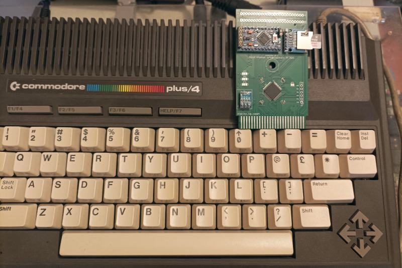
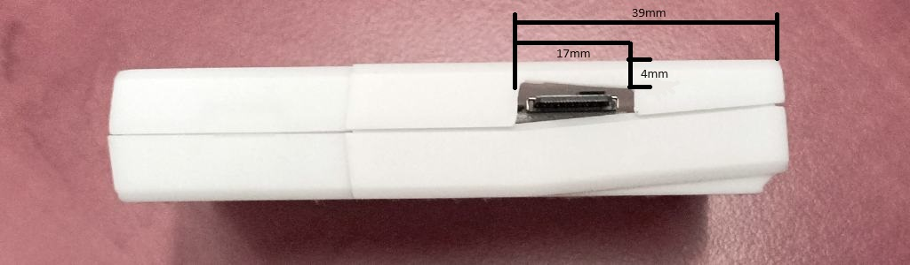

# TCBM2SD 
---------
### by Maciej 'YTM/Elysium' Witkowiak

CBM 1551 paddle replacement and/or mass storage using an SD card interfacing with the Commodore C16/116/Plus4 simulating a TCBM bus 1551 disk drive.

## Detailed manuals

- [User's manual](UserManual.md)
- [Hardware assembly, firmware compilation and flashing](HardwareFirmware.md)

## Software

- [GEOS for tcbm2sd (D64)](geos/geostcbm.d64)
- [Collection of patched disk games](games/)
<!-- XXX patched cartridge images -->

## Media

### Basic operations

<a href="https://www.youtube.com/watch?v=6DOctO64GS4" target="_blank">
 
 
<small>Click for video</small>

</a>

### Fastloader

<a href="https://www.youtube.com/watch?v=Cf42Z9H2JiA" target="_blank">
 
 
<small>Click for video</small>

</a>

## Features

### Drive simulator

The tcbm2sd doesn't emulate 1551, but simulates its behavior:

- DLOAD and DSAVE support for files
- read-only support for disk images (D64, D71, D81, D80, D82) as subdirectories
-  standard Kernal transfer at about 3100b/s (a little bit less than JiffyDOS 1541, twice as fast as 1551 (1600b/s)); fastload at about 9300b/s (**23x** as fast as 1541, about **6x** as fast as 1551), with [patched Directory Browser v1.2](loader/); on par with DolphinDOS
- fastload booter embedded in the flash, available at all times as `*` file will load and run `BOOT.T2SD` file from root directory; this can be any file that can run from BASIC; [Directory Browser patched with fastload protocol](loader/db12b.prg) is recommended
- CBM DOS disk commands: `CD`, `R`, `S`, `MD`, `RD`, `I`, `UI`, `UJ`
- utility commands similar to 1571/81 BURST for fastloader, block-read/write and device number change
- device number stored permanently in EEPROM or configurable with jumpers
- support for absolute paths (up to 71 characters)
- support for SD change detection (if the SD card socket supports it) to automatically initialize card
- PREV/NEXT buttons to switch between disk images
- socket for 32/64K cartridge ROM

### Paddle replacement

It has been confirmed that tcbm2sd works as a 1551 paddle cartridge replacemement with a real 1551 drive. Arduino can be removed or disabled for this purpose.

- PLA 251641-3 and 6523T (28 pin triport) integrated into a single CPLD
- low part count: CPLD, 3.3V voltage regulator and four capacitors
- improved PLA equations make the paddle occupy only 8 I/O addresses
  - FEF0-FEF7 for device 8
  - FEC0-FEC7 for device 9

### Platform for future TCBM developments

The paddle part has all TCBM bus signals exposed and can be used as the basis for future developments porting existing projects to TCBM bus, like:

- Pi1551 - realtime, cycle-exact 1551 emulator
- sd2tcbm - sd2iec port to TCBM bus

For development another daughterboard (or a ready to use uC module) can be used. All the signals of TCBM bus are exposed at the cartridge edge (TCBM connector) or Arduino footprint. Signals are already in 3.3V logic, so no additional level shifter for Raspberry Pi is neccessary.

*Please note that if a TCBM cable is connected then both pins 1 and 16 of the TCBM connection must be connected to GND. It's used by Arduino to detect if TCBM cable is attached so that Arduino can disable itself.*

### Availability

The information published here has everything required to manufacture PCB (gerber files) and program firmware.

If you want a completed unit for yourself please drop me a message (you will find email on top of [loader/loader.asm](loader/loader.asm)). I might have some units to sell. Please include your country name.

<!--
You can also order completed hardware part of the project from PCBWay. This is PCB only, it still requires flashing CPLD and soldering Arduino Mini Pro (or TCBM connector) and voltage regulator:

  -->

## Case

You might be also interested in a cartridge case. It should [fit inside this one](https://www.thingiverse.com/thing:6309306) although would require cutting a slot for SD card.

*This example shows revision 1.1 without NEXT/PREV buttons*

## Credits

This project wouldn't be possible without documentation provided by others:

- [Fake6523](https://github.com/go4retro/Fake6523) and [Fake6523 HW proved](https://github.com/ZXByteman/Fake6523) that I took and trimmed down from full 6523 implementation down to 6323T
- [cia-verilog](https://github.com/niklasekstrom/cia-verilog/blob/master/cia.v) which showed me a better way of interfacing with CPU bus
- [Commodore TCBM bus and protocol description](https://www.pagetable.com/?p=1324)
- [c264-magic-cart](https://github.com/msolajic/c264-magic-cart) and [C264Cart](https://github.com/hackup/C264Cart) which were my template for PCB dimensions
- [LittleSixteen](https://github.com/SukkoPera/LittleSixteen) where I found KiCad expansion port footprint and symbol, also helped me to understand how Plus/4 expansion port works
- [kicad-lib-arduino](https://github.com/g200kg/kicad-lib-arduino)
- @eper973 for Directory Browser source code
- Per Olofsson for `diskimage.c` D64/71/81 handling code
