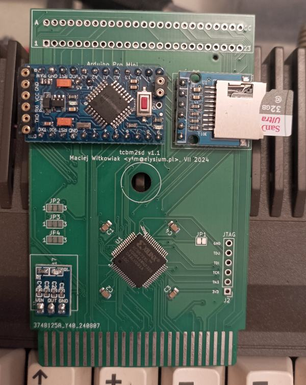

# TCBM2SD 
---------
### by Maciej 'YTM/Elysium' Witkowiak

CBM 1551 paddle replacement and/or mass storage using an SD card interfacing with the Commodore C16/116/Plus4 simulating a TCBM bus 1551 disk drive


It's enough to quickly and easily load file-based programs though it is not as feature rich as sd2iec.

It's fast - with patched Directory Browser you can load 220 blocks within 6 seconds(!). That's speed comparable with [DolphinDOS](https://github.com/ytmytm/c128dcr-DolphinDOS3)

Patched Directory Browser is embedded into flash and available at all times by trying to load `*` file or using `SHIFT+RUN/STOP` key combination.

## Media



### Basic operations

<a href="https://www.youtube.com/watch?v=6DOctO64GS4" target="_blank">
 
 <p><small>Click for video</small></p>
</a>

### Fastloader

<a href="https://www.youtube.com/watch?v=Cf42Z9H2JiA" target="_blank">
 
 <p><small>Click for video</small></p>
</a>

## Features

### Paddle replacement

**NOTE: I don't own a 1551. This circuit should be able to replace original 1551 paddle and work with a real 1551 drive, but it's untested**

- PLA 251641-3 and 6523T (28 pin triport) integrated into a single CPLD
- low part count: CPLD, 3.3V voltage regulator and four capacitors
- improved PLA equations make the paddle occupy only 8 I/O addresses
  - FEF0-FEF7 for device 8
  - FEC0-FEC7 for device 9
- passthrough for all 50 signals of the expansion port

### 1551 drive simulation

- DLOAD and DSAVE support
- read-only support for disk images (D64, D71, D81) as subdirectories
- standard Kernal transfer at about 3100b/s (a little bit less than JiffyDOS 1541, twice as fast as 1551 (1600b/s))
- fastload at about 9300b/s (**23x** as fast as 1541, about **6x** as fast as 1551), with [patched Directory Browser v1.2](loader/); on par with DolphinDOS
- fastload booter embedded in the flash, available at all times as `*` file will load and run `BOOT.T2SD` file from root directory
- [Directory Browser patched with fastload protocol](loader/db12b.prg), save it as `BOOT.T2SD` on your SD card
- device number stored permanently in EEPROM
- disk commands:
  - change dir `CD<directory>`, `CD<disk.d64>`, `CD<leftarrow>` or `CD..`, `CD/`
  - remove file `S:<filename>` (will remove only the first matching file), BASIC `SCRATCH`
  - rename file `S:<new>=<old>`, BASIC `RENAME ... TO ...`
  - create dir `MD<directory>`
  - remove dir `RD<directory>`
  - change device number: `U0>+chr$(<devnum>)` with `<devnum>` = 8 or 9
  - initialize disk: `I` (reinitialize SD interface after card eject/insert)
- limited support for full paths (when filename starts with `/`)
  - you can DLOAD a file from root folder from anywhere in the filesystem, e.g. file browser: `DLOAD"/FB16`; this works as long as the path is not too long
  - disk commands will accept full paths, e.g. `S:/GAMES/D/DONALD DUCK`
- compatible with file browsers: FileBrowser 1.6 and Directory Browser 1.2
- case insensitve, all filenames converted to lowercase
- paths up to 71 characters long
- fallback to DOS 8.3 filename for entries with names longer than 16 characters
- wildcard matching `*` and `?`
- utility commands similar to 1571/81 BURST:
  - fastload file by name: `U0+chr$(31)+<filename>`
  - (within image only) fastload file by its initial track and sector: `U0+chr$(63)+chr$(track)+chr$(sector)`
  - (within image only) fast block-read: `U0+chr$(0)+chr$(track)+chr$(sectors)+chr$(number-of-blocks-to-read)`
  - (within image only) fast block-write: `U0+chr$(2)+chr$(track)+chr$(sectors)+chr$(number-of-blocks-to-write)`
- support for SD change detection (only if the SD card socket supports it) to automatically initialize card
- PREV/NEXT buttons to switch between disk images
- socket for 32/64K cartridge ROM

### Platform for future TCBM developments

The paddle part has all TCBM bus signals exposed and can be used as the basis for future developments porting existing projects to TCBM bus, like:

- Pi1551 - realtime, cycle-exact 1551 emulator
- sd2tcbm - sd2iec port to TCBM bus

For development another daughterboard (or a ready to use uC module) can be used. All the signals of TCBM bus are exposed at the cartridge edge (TCBM connector) or you can use Arduino footprint instead.

*Please note that if a TCBM cable is connected then both pins 1 and 16 of the TCBM connection must be connected to GND. It's used by Arduino to detect if TCBM cable is attached so that Arduino can disable itself.*

### Availability

The information published here has everything required to manufacture PCB (gerber files) and program firmware. Check out the 'Releases' section on the right.

If you want a completed unit for yourself please drop me a message (you will find email on top of [loader/loader.asm](loader/loader.asm)). I might have some units to sell. Please include your country name.

You can also order completed hardware part of the project from PCBWay. This is PCB only, it still requires flashing CPLD and soldering Arduino Mini Pro (or TCBM connector) and voltage regulator:

<!-- <a href="https://www.pcbway.com/project/shareproject/tcbm2sd_1551_disk_drive_simulator_8b13bbf7.html"></a> -->

### tcbm2sd or sd2tcbm?

This project is named tcbm2sd because it is not a sd2iec port, just a simple 1551 simulator.

This is more like [Tapecart](https://github.com/KimJorgensen/tapecart) - a loader for file-based programs rather than sd2iec.

If a proper sd2iec port to TCBM bus ever appears it should be named sd2tcbm.

Another microcontroller would have to be used for sd2tcbm because ATmega328 from Arduino Micro Pro doesn't have enough flash space for sd2iec port.

## KiCad project

Project files for Kicad 6.0 are in [this folder](tcbm2sd).

## Schematic

A PDF plot of schematic is available here: [tcbm2sd/plots/tcbm2sd.pdf](tcbm2sd/plots/tcbm2sd.pdf) for preview.

## PCB

The first revision of PCB was meant primarily as a MVP demonstration and a development platform for software, so it relies on cheap, ready to use modules


Gerber files for manufacturing are in [tcbm2sd/plots/](tcbm2sd/plots) folder.

Starting with revision rev1.2 the PCB contains both kind of footprints - holes for ready to use modules or a set of SMD parts to be soldered directly. Except for CPLD chip all the parts are quite large (0805 footprint) for easy soldering by hand.

### Jumpers

| Jumper | default | Description |
|--------|-----------------|-----------|
| JP1 | closed | if closed, then pass computer reset to Arduino |
| JP2 | n/c | choose hardware device number by shorting (2-3) for #8 or (1-2) for #9 |
| JP3 | (1-2) | choose software device number from Arduino A4 (1-2) or RXD/D1 (2-3) |
| JP4 | (1-2) | choose device number in software (1-2) or hardware (2-3) |

JP1, JP3 and JP4 default values are shorted by a thin trace under soldermask. If you want to change any of these settings you have to cut between the pads until connection is gone.

JP3 is meant for Arduino Mini Pro clones that would have A4 line missing or in a completely different place. Note that you have to change the definitions on the top of the sketch code too.

### Cartridge ROM

There is a socket for a 32K (27E257) or 64K (27E512) EPROM/EEPROM for cartridge functionality.

The 32K ROM will appear for the system as cartridge 1.

The bottom half of 64K ROM will appear as cartridge 2, the top half as cartridge 1.

### PREV/NEXT buttons

These buttons allow to switch to next/previous disk image within a folder. They work for all supported files: D64/D71/D81.

The PREV button signal serves also as a way to detect if TCBM cable is connected upon reset (pin 16 of TCBM connector shorted to GND).

NEXT button signal detects if the buttons are connected at all - if it's shorted to GND (pressed) upon Arduino reset then the button functionality is disabled.

## Parts

Parts to be soldered directly:

- 1x XC9572XL-VQ64 CPLD
- 4x 0.1uF capacitor (0805 footprint)
- Arduino Mini Pro with ATmega328P 3.3V or its clone, e.g. SparkFun DEV-11114; unnamed clones usually have 'The Simple' text on bottom soldermask; there are two versions that differ by location of A6/A7 pins, both are supported

For the remaining parts of the circuit you can go with ready for use modules or solder SMD parts directly.

### Modules

- AMS1117 3.3V power supply module with 3 pins, [such as this](media/AMS1117.jpg) often labeled as HW764; it usually comes with soldered angled pins, you need to replace them with straight ones
- SD card 3.3V adapter (3.3V VCC, with no level shifters) [like this one](media/SD.jpg)

### SMD parts

The SMD BOM file with part names and can be find in the [releases](releases).

### Arduino Mini Pro A4/SDA pin

Clones of Arduino Mini Pro may have different placement of A4/A5/A6/A7 pins.

On some clones `A4` may be labeled as `SDA` (then `A5` is `SCL`). This is fine.

If A4/A5 pins were moved from the inside row to a different place then solder a short piece of wire between module's `A4` and PCB pad marked `DEV` (next one to `A5`). `A4` is the only one required.

If `A4` is not available at all then you can modify the sketch to use `D1` (`RXD`) instead for DEV line and change JP3 jumper.

If you don't need software device number setting, you can permanently set the device number using JP2 and JP4.

## CPLD Firmware

### CPLD source code

Verilog source code can be found in [hdl](hdl/) folder. Apart from `.v` files there are also project files for [Xilinx ISE 14.7](https://www.xilinx.com/support/download/index.html/content/xilinx/en/downloadNav/vivado-design-tools/archive-ise.html).
If you want to modify them and rebuild `.jed` file, I highly recommend using Linux version, even with Windows WSL it's much easier to install and with fewer install/startup issues than the Windows version.

The code implements 4 parts:

1. PLA 251641-3 logic equations, updated to activate 6523T port only within 8 bytes indicated by the device input line
2. 8-bit, bidirectional port A of 6523T
3. 2-bit, bidirectional port B of 6523T (bits 0 and 1 - status from the drive)
4. 2-bit, bidirectional port C of 6523T (bit 7 (input from the drive) and bit 6 (output to the drive))

The 6523T code was based on a trimmed-down copy of [Fake6523](https://github.com/go4retro/Fake6523) and a [CIA implementation](https://github.com/niklasekstrom/cia-verilog/blob/master/cia.v).

The remaining, unused, bits of Ports B and C will probably behave in a different way than with a real 6323T. So far I didn't find it as an issue though.

### CPLD flashing

JEDEC file with CPLD fimware is here: [hdl/Fake6523.jed](hdl/Fake6523.jed).

You don't need any special equipment to flash it. A Raspberry Pi and some jumper wires will be enough. If you can hold them more or less steady there is no need to solder any pin headers for JTAG connector.

| Signal | GPIO Header Pin | GPIO Name |
|--------|-----------------|-----------|
| GND | 6 or 9 or 14... | GND |
| TDO	| 13 | GPIO 27 |
| TDI	| 15 | GPIO 22 |
| TCK	| 11 | GPIO 17 |
| TMS	| 7  | GPIO 4 |
| 3.3V | 1 | 3.3V |

Command to test the connection and list JTAG devices (our XC9572 will be most likely device 0):
```
xc3sprog -c matrix_creator
```


Command to flash the firmware to device on position 0 (`-p 0`)
```
xc3sprog -c matrix_creator -v -p 0 Fake6523.jed
```

There is [an excellent reference about programming XC9500XL](https://anastas.io/hardware/2020/09/29/xc9500-cpld-raspberry-pi-xc3sprog.html) via JTAG with Raspberry Pi. Please read it for more details.

## Arduino firmware

### Arduino source code

The source code of Arduino Mini Pro sketch is in [tcbm2sd_arduino/tcbm2sd/](tcbm2sd_arduino/tcbm2sd/) folder.

In Arduino IDE settings choose board `Arduino Mini w/ Atmega328 (3.3V)`.

The only dependency (other than Arduino IDE) is [SDFat 2.2.3](https://github.com/greiman/SdFat) library (this code was developed when 2.2.3 was the latest available version). It's available directly from Arduino IDE library manager.

The disk image handling code is a trimmed down 'diskimage' library from CGTerm, by Per Olofsson.

### Arduino flashing

A basic USB-serial dongle (CH340G or similar) with 6 pins is enough to flash the firmware. Mind the pin labels (order may be reversed), but the connection is usually one to one (without any crossings) with one of the pins left unconnected.
This is the only time, when the 6 pins on the short side of Arduino Mini Pro board will be used.

| USB dongle pin | Arduino Mini pin |
|----------------|-------------|
| DTR            | DTR (next to RAW label) |
| RXD            | TX0         |
| TXD            | RX0         |
| VCC            | VCC         |
| CTS            | GND (not connected) |
| GND            | GND         |

**UPLOAD PROBLEMS**

Many Ardunio Mini Pro clones are sold with old bootloader flashed. That was the case for me. (They are also unable to use 115200 serial speed, but that's another story).
If you have trouble uploading the compiled code check if changing the upload speed from 115200 (new bootloader) to 57600 (old bootloader) helps.

Close the IDE and find you Arduino `boards.txt` settings file. On Windows it will be in `C:/Users/<user name>/AppData/Local/Arduino15/packages/arduino/hardware/avr/1.8.6/boards.txt`

Find there a line:
```
mini.menu.cpu.atmega328.upload.speed=115200
```
and change it to
```
mini.menu.cpu.atmega328.upload.speed=57600
```

Reopen the Arduino IDE and try again.

**WARNING**

1. Be sure to setup you USB dongle to 3.3V operation. They usually have a switch for that.
2. For development I have been reflashing Arduino code while cartridge was still connected to the computer. For this case make sure **to disconnect the VCC** line.

## C16, C116, Plus/4 firmware

### Autostart/boot feature

If the filename is a single '*' (like after pressing `SHIFT+RUN/STOP`) then a small loader will be sent to the computer. This loader will try to load and run file `BOOT.T2SD` from the SD card's root folder.

I recommend [loader/boot.t2sd](Directory Browser 1.2 (TCBM2SD)) patched for fast loading of the files.

The source code for the loader is in [loader/loader.asm](loader) folder. You need [KickAssembler](https://www.theweb.dk/KickAssembler/) to rebuild it.

This code also serves as an example how to handle fastloader protocol.

The provided `Makefile` doesn't do much but it shows the order of commands:

Assemble the code:
```
java -jar Kickass.jar loader.asm
```
This saves `loader.prg`. To embed that binary into Arduino Micro flash we need to convert it to a C-style array and put into Arduino sketch folder:
```
xxd -i loader.prg ../tcbm2sd_arduino/tcbm2sd/loader.h
```

Then the Arduino code has to be recompiled and uploaded to the device.

### Directory browser 1.2 (TCBM2SD)

Thanks to Géza Eperjessy, the author of 'Directory browser', I got access to its source code and I could change the code directly to support fast protocol when TCBM2SD is detected in response to `UI` command.

The fast protocol is used for loading the directory listing and the files.

The binary is here [loader/boot.t2sd](boot.t2sd).

To make that file your default browser that will startup every time you load and run `*` file save it on the SD card's root folder as 'BOOT.T2SD`.

### Fastloader

tcbm2sd is compatible with standard TCBM protocol as implemented by Commodore in Plus/4 ROM. However the hardware is capable with much more.
I took [Directory Browser v1.2](https://plus4world.powweb.com/software/Directory_Browser) and I patched it to use a faster protocol, a bit similar to [Warpload 1551](https://plus4world.powweb.com/software/Warpload_1551).
The only difference is that since Arduino Micro Pro is much faster than Plus/4 (8MHz vs 1MHz) it would be hard to rely on the timing, so in my version of the fast protocol both sides need to test if the other end has confirmed receiving the data.

#### Fastloader (channel 16)

Fast protocol is enabled when everything is prepared like for load (OPEN channel 0 and send the filename) but after the `TALK` call as a secondary address we send `0x70` instead of `0x60` - talk on channel 16 rather than 0. There is no check if the remote device is a tcbm2sd and actually supports this protocol.

Check out also the other files from [loader/](loader/) folder. I can't publish full source code (it's not mine), but you will find pieces of code I altered in 't2s-...' files.

#### Fastloader (U0 command, filename)

Starting with revision 1.2 there is a simpler way to call fastloader. Just send a command over channel 15 that consists of `U0<$1f>` followed by the filename.
```
command:
	.byte "U0", $1f
	.byte "FILENAME"
```
The example code for this is the firmware for `/BOOT.T2SD`: [loader/loader.asm](loader/loader.asm)

#### Fastloader (U0 command,track,sector)

Another way of loading the file from disk image is to point directly to track and sector where the file starts.
This is done by sending a command over channel 15 that consists of `U0<$3f>` followed by track and sector:
```
command:
	.byte "U0", $3f
track:	.byte 17
sector:	.byte 1
```

The example code for this is here: [loader/loaderts.asm](loader/loaderts.asm)
This works only from within disk image.

#### Fast BLOCK-READ, BLOCK-WRITE

Single sectors can also be loaded from the disk image with fast protocol. The U0 command for this is `U0<$00>` followed by track and sector and number of sectors to load. Since we're working on a disk image after the last sector on a given track we will automatically start reading from the next one.

For writing directly to disk the command is `U0<$02>` followed by track, sector and number of sectors that will be written.

An example code for both these functions can be found in [loader/block-rw.asm](loader/block-rw.asm).
This is a simple utility that can load a single sector (directory header) to screen ram (`$0C00`) and the buffer (`$2000`) or write data from the buffer into the directory header.

The code there also servers as a reference how to use fast save protocol.

### Directory browser 1.2b

*(This serves as an example of directly patching a binary file)*

The source code for the patch is in [loader/db12patch.asm](loader/db12patch.asm) file. You need [KickAssembler](https://www.theweb.dk/KickAssembler/) to rebuild it.

Assemble the patch and apply it over the binary
```
java -jar Kickass.jar db12patch.asm
```
This saves `db12b.prg` patched directory browser that can be put on an SD card to be `DLOAD`ed and executed.

## Case

You might be also interested in a cartridge case. It should [fit inside this one](https://www.thingiverse.com/thing:6309306) although would require cutting a slot for SD card.


## Credits

This project wouldn't be possible without documentation provided by others:

- [Fake6523](https://github.com/go4retro/Fake6523) and [Fake6523 HW proved](https://github.com/ZXByteman/Fake6523) that I took and trimmed down from full 6523 implementation down to 6323T
- [cia-verilog](https://github.com/niklasekstrom/cia-verilog/blob/master/cia.v) which showed me a better way of interfacing with CPU bus
- [Commodore TCBM bus and protocol description](https://www.pagetable.com/?p=1324)
- [c264-magic-cart](https://github.com/msolajic/c264-magic-cart) and [C264Cart](https://github.com/hackup/C264Cart) which were my template for PCB dimensions
- [LittleSixteen](https://github.com/SukkoPera/LittleSixteen) where I found KiCad expansion port footprint and symbol, also helped me to understand how Plus/4 expansion port works
- [kicad-lib-arduino](https://github.com/g200kg/kicad-lib-arduino)
- @eper973 for Directory Browser source code
- Per Olofsson for `diskimage.c` D64/71/81 handling code
